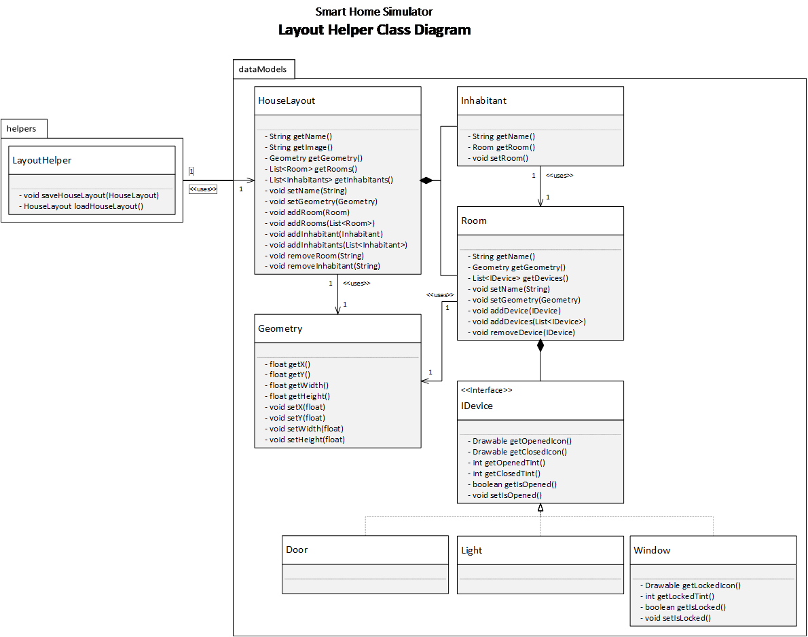

# Smart Home Simulator

This simulator was developed as a requirement for the SOEN343 course given at Concordia University. The simulator is meant to replicate a Smart Home envrionment to allow for easy testing of Smart Home Systems without the hassle related to setting up physical systems. The simulator should also provide more consistent and predictable results leading to an overall better testing environment.

#### The Team

- Quandeel Arshad *(?)*
- Luigi Besani Urena *(?)*
- William Morin-Laberge *(?)*
- Aswin Philip *(?)*
- Pierre-Olivier Trottier *(40059235)*

## Documentation

The following documentation will graphically describe the general organisation of the program in the form of a Domain Model diagram, different Class diagrams, and a sequence diagram describing the Simulation context.

#### Domain Model

#### Layout Helper Class Diagram

